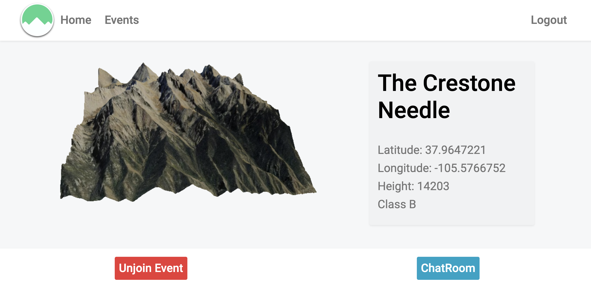
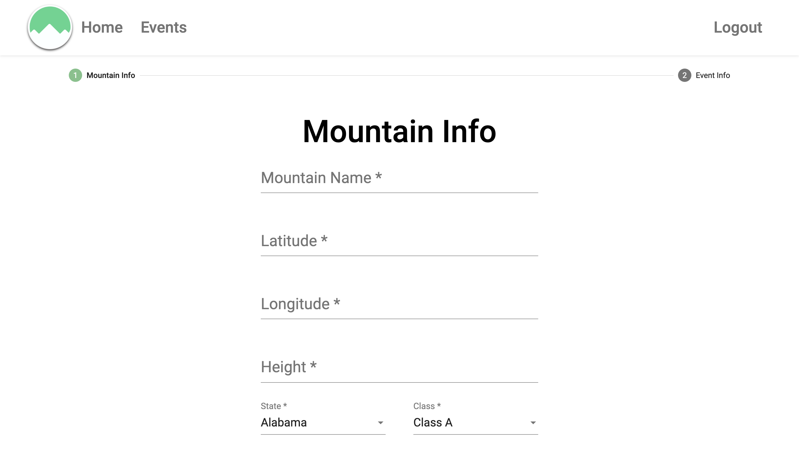

## Mountains
### Skill Distillery Final Project

Mountains was a Full Stack Application that allows user who love hiking and climbing to create and joi events for their passion. 

### live link

http://inzurriaga.com:8080/Mountains

### Event Page

### Create Event Page

## Tools Utilized:
* Angular
* Three.js
* Java
* Filashack SDK
* WebSocket
* Spring Boot
* JPA
* Sass
* TypeScript
* HTML
* CSS

### Authors
* [Gabriel Inzurriaga](https://github.com/Inzurriaga)
* [Michael Krog](https://github.com/MRKrog)
* [Julia Marco](https://github.com/juliamarco)